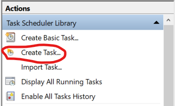
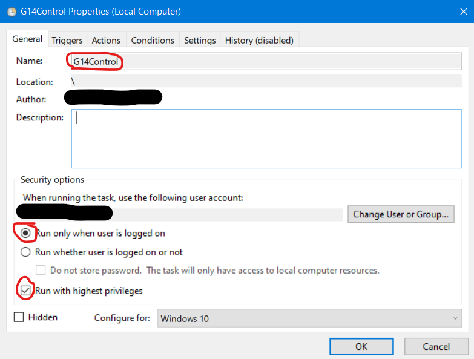
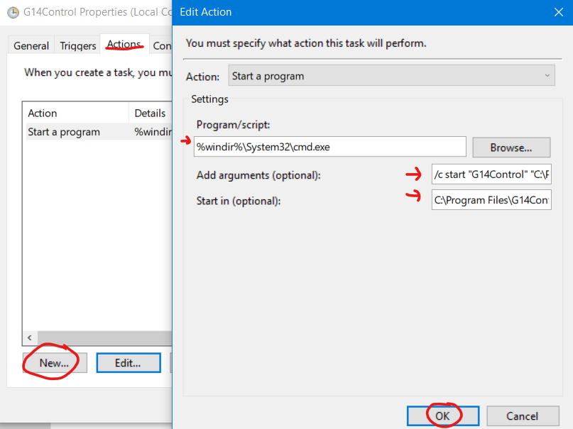
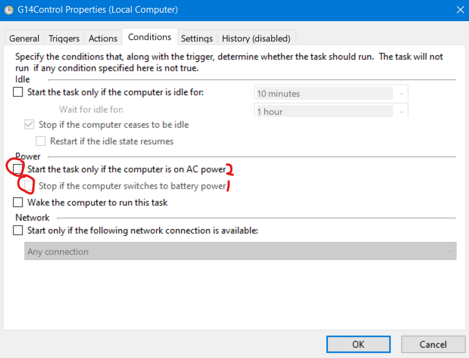

# G14Control

## How to start program on boot

Prerequisite: Make sure G14Control folder is somewhere permanent, in this case it is in C:\Program Files\G14Control

1) Go to start menu and open 'Task Scheduler'

2) Create a new task

3) In the General Tab, Name it G14Control, make sure 'Run when user logged in' and 'Run with highest privileges'

4) On actions tab, create 'New' action. In Action window enter the following (in our example, your location of G14Control.exe may differ):
 - Program/script: %windir%\System32\cmd.exe
 - Add Arguments: /c start "G14Control" "C:\Program Files\G14Control\G14Control.exe"
 - Start in: C:\Program Files\G14Control\

 

 5) In conditions tab, uncheck 'Stop if switches to battery power' THEN 'start only if on ac'

  

6) Click OK to save. Try rebooting, a seconds to minutes after logging back in, you should see the G14 Tray icon appear!
